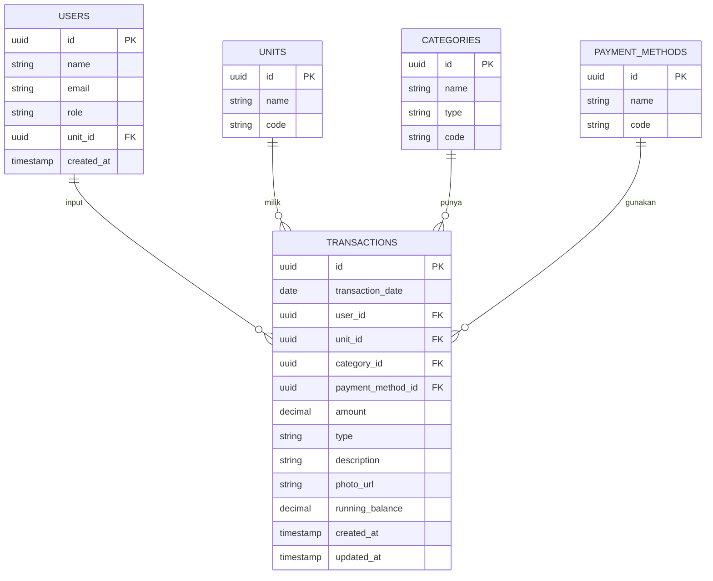

# ERD - ALBA-APPS (Entity Relationship Diagram)

**Format**: Mermaid (bisa copy ke https://mermaid.live)

---

## Ringkasan Tabel Utama

| Tabel | Fungsi Utama | Relasi |
|-------|--------------|--------|
| `users` | Login + Role | 1 user → banyak transaksi |
| `units` | Kantor, Kantin, Koperasi | 1 unit → banyak transaksi |
| `categories` | Jenis pengeluaran/pemasukan | 1 kategori → banyak transaksi |
| `payment_methods` | TF, Tunai, dll | 1 metode → banyak transaksi |
| `transactions` | Data inti buku besar | Core table |

---

## Catatan Penting
- `running_balance` dihitung otomatis setelah setiap transaksi
- `photo_url` menyimpan link foto bukti (Supabase Storage)
- Semua tabel pakai `uuid` sebagai primary key
- Soft delete disarankan untuk transaksi (bukan hard delete)